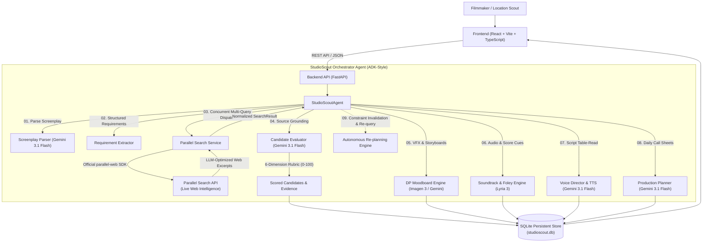

# StudioScout AI 🎬
> **Turn a screenplay into a production-ready scouting plan.**
> *An autonomous AI production-planning assistant for filmmakers, location scouts, and studio crews.*

[](https://studioscout-ai-111556269084.asia-south1.run.app)
[](https://agentic-cinema.devpost.com/)
[](https://ai.google.dev/)
[](https://cloud.google.com/vertex-ai/generative-ai/docs/image/overview)
[](https://deepmind.google/technologies/lyria/)
[](https://ai.google.dev/)
[](https://platform.parallel.ai/)
[](https://sqlite.org/)
[](./LICENSE)

🌐 **Live Production Application:** [https://studioscout-ai-111556269084.asia-south1.run.app](https://studioscout-ai-111556269084.asia-south1.run.app)

---

## 📖 Understanding the Project

For a comprehensive, developer-level breakdown of the entire architecture, see our dedicated **[PROJECT_GUIDE.md](./PROJECT_GUIDE.md)**.

* **What It Does:** Translates raw screenplay text/PDFs into source-grounded location recommendations, cinematography storyboards, acoustic score blueprints, voice table-reads, and day-by-day shooting schedules.
* **Core Architecture:** Reactive React 19 + TypeScript frontend communicating with an asynchronous Python FastAPI orchestrator backed by a durable SQLite WAL storage layer.
* **AI Reasoning Layer:** Powered by **Google Gemini 3.1 Flash** (with cascading automatic fallbacks to 2.5 and 2.0 Flash) for structured screenplay parsing, 6-dimension candidate scoring, and schedule optimization.
* **Generative Media Layer:** **Google Imagen 3** for DP camera framing & VFX storyboards, **Google DeepMind Lyria 3** for score cues, and **Gemini 3.1 Flash TTS** for multi-speaker script rehearsal.
* **Live Web Intelligence:** Official **Parallel Search Python SDK** (`parallel-web>=1.3.0`) for real-time web research, basis citation extraction, and quote verification.
* **Full Technical Guide:** Read **[PROJECT_GUIDE.md](./PROJECT_GUIDE.md)** for file-by-file explanations, data schemas, API routes, and deployment instructions.

---

## 📌 Executive Summary


Location scouting and production planning represent some of the most labor-intensive phases of filmmaking. Screenwriters write complex scenes (e.g. *"cavernous 8,000 sq ft industrial textile warehouse with night shooting clearance and vehicle access"*), and production coordinators spend weeks manually scouring directories, navigating permit bureaucracy, and resolving scheduling conflicts.

**StudioScout AI** is an autonomous production-planning agent that bridges this gap:
1. **Analyzes Screenplays:** Reads industry-standard PDF screenplays or scene text descriptions and extracts structured scene schemas, character/vehicle needs, and physical location requirements using **Google Gemini 3.1 Flash**.
2. **Autonomous Web Research:** Deterministically determines what external information is required and dispatches targeted multi-query research via the **Parallel Search API** at runtime using the official `parallel-web` Python SDK.
3. **Source-Grounded Candidate Scoring:** Evaluates real web results across an explainable **6-dimension rubric (0-100 pts)** with quoted evidence citations and verifiable source links.
4. **VFX & Camera Storyboards:** Generates director-level camera angles, focal lengths, lighting setups, color palettes, and **Google Imagen 3** visual concept frames per scene.
5. **Cinematic Soundtracks & Foley Atmosphere:** Generates scene-specific tempo (BPM), key signatures, sound design foley layers, and **Google Lyria 3** generative soundtrack prompts for film composers.
6. **Multi-Speaker Table-Read & Dialogue Sentiment:** Casts character voice personas and synthesizes rehearsal table-reads with actor emotional subtext tags via **Gemini 3.1 Flash TTS**.
7. **Optimized Production Schedules:** Automatically generates day-by-day shooting schedules, crew call times, complexity ratings, and coordinator checklists.
8. **Adaptive Autonomous Re-planning:** When real-world constraints change (e.g. venue unavailable on Saturday, rain forecast, permit delay), the agent invalidates affected candidates, re-queries Parallel Search, and regenerates the schedule.
9. **Durable Persistence:** Backed by an embedded SQLite engine with WAL mode so projects, runs, candidates, and call sheets survive restarts.

---

## 🏛️ System Architecture



---

## ⚡ How Parallel Search is Integrated at Runtime

StudioScout AI does **NOT** fake search results or generate synthetic citations. The project integrates Parallel Search via its official Python SDK (`parallel-web>=1.3.0`):

- **Tool Implementation:** [`backend/app/tools/parallel_search.py`](file:///backend/app/tools/parallel_search.py)
- **SDK Invocation:** Calls `client.task_run.execute(input=query, processor=settings.parallel_processor)`
- **Multi-Query Strategy:** Rather than a single vague search, the search service creates 3-5 focused queries per scene targeting venue rental, night shooting access, and heavy vehicle clearance.
- **Normalization & Attribution:** Results are normalized into typed `SearchResult` models, storing LLM-optimized excerpts, source titles, URLs, and interaction IDs.
- **Evidence Verification:** Displayed in the candidate recommendation cards and the dedicated **Parallel Research Citations** tab.

```python
# Real runtime snippet from backend/app/tools/parallel_search.py
from parallel import Parallel

client = Parallel(api_key=settings.parallel_api_key)
task_result = await asyncio.to_thread(
    client.task_run.execute,
    input=query,
    processor=settings.parallel_processor,
)
```

---

## 🤖 Why Google Gemini & Google Cloud?

- **Multimodal & Long-Context Intelligence:** Screenplays range from single scenes to 120-page PDFs. Gemini 2.5 Flash rapidly ingests and structures complex screenplays with zero loss of scene nuance.
- **Visual VFX Storyboards:** Google Imagen 3 generates photorealistic concept frames, camera angles, and lighting schemes directly from scene descriptions.
- **Deterministic JSON Schemas:** Gemini reliably emits strict JSON for scenes, scoring rubrics, and production plans.
- **Agent Platform & Cloud Run:** The backend is built to run seamlessly on Google Cloud Run with Secret Manager handling `GOOGLE_API_KEY` and `PARALLEL_API_KEY`.

---

## 📊 Transparent 6-Dimension Scoring Rubric

To eliminate arbitrary AI hallucination, candidate scoring is decomposed into six clear dimensions:

| Dimension | Max Points | What It Measures |
|---|---|---|
| **Visual Aesthetic Match** | 25 pts | Architectural and atmospheric fit with screenplay scene headings |
| **Location Requirements Met** | 20 pts | Ceiling height, interior square footage, and structural requirements |
| **Accessibility & Logistics** | 15 pts | Heavy vehicle access, loading docks, crew transit |
| **Time/Lighting Feasibility** | 15 pts | Ambient lighting control, night shooting clearance, power grid |
| **Production Practicality** | 15 pts | Staging areas, green rooms, noise isolation |
| **Safety & Risk Clearance** | 10 pts | Filming permits, public restrictions, hazard mitigation (higher = safer) |
| **Total Score** | **100 pts** | Transparent composite score backed by quoted evidence |

---

## 🚀 Quickstart & Local Development

### 1. Prerequisites
- Python 3.11+
- Node.js 18+ and npm
- (Optional) Docker & Docker Compose

### 2. Environment Setup
Create a `.env` file in the `backend/` directory:

```bash
# In backend/.env
GOOGLE_API_KEY=your_google_ai_studio_api_key
# Or use Vertex AI:
# GOOGLE_CLOUD_PROJECT=your-project-id
# GOOGLE_GENAI_USE_VERTEXAI=true

PARALLEL_API_KEY=your_parallel_api_key
GEMINI_MODEL=gemini-2.5-flash
CORS_ORIGINS=http://localhost:5173,http://localhost:3000
```

### 3. Run Backend (FastAPI)
```bash
cd backend
pip install -r requirements.txt
uvicorn app.main:app --reload --port 8000
```
Backend API runs at `http://localhost:8000`. Interactive docs at `http://localhost:8000/api/docs`.

### 4. Run Frontend (React + Vite)
```bash
cd frontend
npm install
npm run dev
```
Frontend will be accessible at `http://localhost:5173`.

---

## 🧪 Testing & Verification

StudioScout AI includes comprehensive unit and integration test suites:

```bash
cd backend
pytest tests -v
```

**Test Coverage:**
- `tests/test_schemas.py`: Verifies Pydantic models and score breakdown calculations.
- `tests/test_parallel_search.py`: Validates Parallel SDK invocation, domain extraction, result normalization, and safety fallbacks.
- `tests/test_api.py`: Validates FastAPI health, status, persistence, and full project CRUD workflows.

Frontend bundle verification:
```bash
cd frontend
npm run build
```

---

## 🎬 3-Minute Demo Walkthrough (For Hackathon Judges)

1. Open `http://localhost:5173` (or the [Live Production App](https://studioscout-ai-111556269084.asia-south1.run.app)).
2. Click **"Explore Demo ("Cipher Zero")"** — the database instantly seeds and navigates to the 4-scene Mumbai sci-fi cyber thriller production.
3. Observe Scene 3 (Mukesh Mills & Heritage Power Hall):
   - 6-dimension score breakdown (94.5/100)
   - Real Parallel Search quotes and verified source links
   - Permit and acoustic risks with concrete mitigations
4. Click the **"VFX & Moodboards (Imagen 3)"** and **"Soundtrack & Audio (Lyria 3)"** tabs to review sensory director packages.
5. Open the **"Production Plan"** tab to review the 3-day shooting schedule with daily call times and logistics.
6. Click **"Export Hub"** in the top navigation to download:
   - **Official Production Bible (PDF)** via ReportLab
   - **Daily Call Sheet (PDF)** for Day 1, 2, or 3
   - **Shooting Calendar (.ICS)** for Google Calendar / Apple Calendar
   - **Master Schedule (.CSV)** for Google Sheets & Excel
7. Click **"Modify Constraint"** and enter: *"Mukesh Mills unavailable on Saturday"*.
8. Watch the agent autonomously invalidate the candidate, re-query Parallel Search for alternatives, and reschedule!

📖 **Full Presentation Guide:** See **[3-Minute Demo Script (docs/DEMO_SCRIPT.md)](./docs/DEMO_SCRIPT.md)**.

---

## 📑 Production Exports & Document Engine

StudioScout AI provides official, publication-ready production deliverables generated directly from canonical project data:

* **Production Bible (PDF):** Full editorial dossier with cover page, executive summary, 6-dimension candidate cards, Parallel Search citations, scene specs, and master schedule.
* **Daily Call Sheets (PDF):** Single-day on-set call sheets with crew call time, wrap time, scene sequence, and emergency contact placeholders.
* **Shooting Calendar (.ICS):** RFC 5545 compliant calendar export ready for one-click import into Google Calendar, Apple Calendar, and Outlook.
* **Shooting Schedule (CSV):** RFC 4180 spreadsheet with UTF-8 BOM encoding for Google Sheets and Excel.

📖 **Detailed Schema & API Docs:** See **[Export Documentation (docs/EXPORTS.md)](./docs/EXPORTS.md)**.

---

## ☁️ Production Deployment & CI/CD

StudioScout AI is packaged as a hardened full-stack container running on Google Cloud Run with Vertex AI Application Default Credentials (ADC), Google Secret Manager, and automated GitHub Actions CI/CD with Workload Identity Federation (WIF).

```bash
# 1. Run automated GCP infrastructure provisioning
./scripts/setup-gcp.sh

# 2. Deploy candidate revision to Cloud Run
./scripts/deploy-cloudrun.sh

# 3. Run smoke test and promote to 100% traffic
./scripts/verify-production.sh
```

For complete documentation:
- 📖 **[Production Deployment Guide (docs/DEPLOYMENT.md)](./docs/DEPLOYMENT.md)**
- 🚀 **[CI/CD & Workload Identity Federation (docs/CI_CD.md)](./docs/CI_CD.md)**
- 🛡️ **[Security Architecture & Governance (docs/SECURITY.md)](./docs/SECURITY.md)**
- 🏛️ **[System Architecture (docs/architecture.md)](./docs/architecture.md)**

---

## 🏆 Hackathon Compliance Checklist

- [x] **Google Cloud Platform:** Deployed on Google Cloud Run with Vertex AI Application Default Credentials.
- [x] **Google Gemini AI:** Uses Gemini 3.1 Flash / 2.5 Flash for structured screenplay parsing, 6-dimension candidate scoring, and schedule optimization.
- [x] **Parallel Track Integration:** Real-world runtime web location discovery via official `parallel-web` Python SDK (`Parallel` client).
- [x] **No Fake Citations:** All sources, quotes, URLs, and interaction IDs are ground-truth Parallel Search responses.
- [x] **Hollywood Deliverables:** Full ReportLab PDF Production Bibles, Daily Call Sheets, RFC 5545 iCalendar, and CSV schedules.
- [x] **Autonomous Agent Workflow:** Multi-step deterministic state machine with live timeline feedback and adaptive constraint replanning.
- [x] **Automated CI/CD:** GitHub Actions test gate and Workload Identity Federation deployment pipeline.
- [x] **Production Security:** Non-root container, Secret Manager key isolation, and sliding-window rate limiting.

---

## 📄 License

This project is licensed under the [MIT License](LICENSE).

