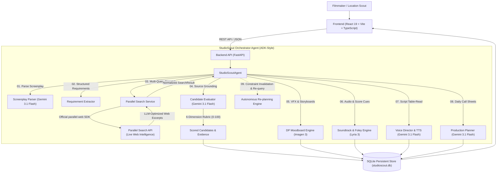

# StudioScout AI — System Architecture

StudioScout AI is an autonomous, multi-step film production-planning assistant designed for the **Google Cloud Agentic Cinema Hackathon 2026 (Parallel Track)**.

---

## 1. High-Level Architecture

---

## 2. Component Breakdown

### A. Frontend Layer (React 19 + Vite + TypeScript + Tailwind CSS + Three.js)
- **Playful Geometric Design System:** Custom retro-playful palette (`#8B5CF6`, `#FBBF24`, `#F472B6`), micro-animations, accessible high contrast.
- **Scene Breakdown Panel:** Shows parsed scenes, characters, vehicles, and prioritized production requirements.
- **Candidate Cards:** Displays match score, 6-metric breakdown preview, strengths, verified risks, and Parallel Search citations.
- **Interactive 3D Production Map:** Three.js isometric city grid with interactive scene pins.
- **VFX Storyboard & Audio Score Decks:** Visual frames (Google Imagen 3), acoustic scores (Google DeepMind Lyria 3), and voice rehearsals (Gemini 3.1 Flash TTS).
- **Studio Crew Auth Switcher:** 1-click role switcher (Director, Location Scout, Line Producer, Hackathon Judge).

### B. Backend API Layer (FastAPI + Python 3.11+)
- **`app/main.py`:** Application entry point, CORS middleware, lifespan manager, health and status endpoints.
- **`app/api/projects.py`:** Project creation with PDF parsing (`pdfplumber`) or text inputs, retrieval, and source listing.
- **`app/api/runs.py`:** Autonomous scouting execution, status polling, and replanning trigger endpoints.
- **`app/api/storyboards.py` & `app/api/audio.py` & `app/api/tableread.py`:** VFX, acoustic score, and script table-read endpoints.
- **`app/store.py`:** Durable SQLite store with WAL mode for all entities.

### C. Agent Orchestration Layer (ADK-Style)
- **`app/agent/root_agent.py`:** Deterministic orchestrator managing the state machine (`analyzing` -> `researching` -> `evaluating` -> `planning` -> `replanning` -> `completed`) with concurrency control.
- **`app/tools/screenplay_parser.py`:** Extracts structured JSON scene schemas using Gemini 3.1 Flash.
- **`app/tools/candidate_evaluator.py`:** Evaluates Parallel Search web snippets against 6-dimension rubric.
- **`app/tools/storyboard_generator.py`:** Generates cinematography lens, lighting, and Google Imagen 3 prompts.
- **`app/tools/audio_generator.py`:** Composes Google DeepMind Lyria 3 score blueprints and foley layers.
- **`app/tools/dialogue_director.py`:** Casts Gemini TTS character voices and analyzes subtext sentiment.
- **`app/tools/planner.py`:** Generates day-by-day shooting schedules, crew call times, and contingency re-plans.

### D. Partner Integration Layer — Parallel Search Tool
- **`app/tools/parallel_search.py`:** Official integration using the `parallel-web` Python SDK.
- **Multi-Query Strategy:** Generates 3-5 focused search queries per scene (e.g. venue rental, night access, heavy vehicle clearance).
- **Result Normalization:** Cleans excerpts, extracts domains, records interaction IDs, and deduplicates URLs.

---

## 3. Explainable 6-Dimension Scoring Model

| Dimension | Weight | Description |
|-----------|--------|-------------|
| **Visual Aesthetic Match** | 25 pts | Architectural and atmospheric alignment with scene descriptions |
| **Location Requirements Met** | 20 pts | Ceiling height, interior square footage, and structural needs |
| **Accessibility & Logistics** | 15 pts | Heavy vehicle access, loading docks, crew transit |
| **Time/Lighting Suitability** | 15 pts | Controlled ambient lighting, night-shooting feasibility |
| **Production Practicality** | 15 pts | Staging areas, green rooms, power grid, noise isolation |
| **Safety & Risk Clearance** | 10 pts | Filming permits, public restrictions, hazard mitigation |
| **Total Score** | **100 pts** | Transparent composite score with source citation links |
